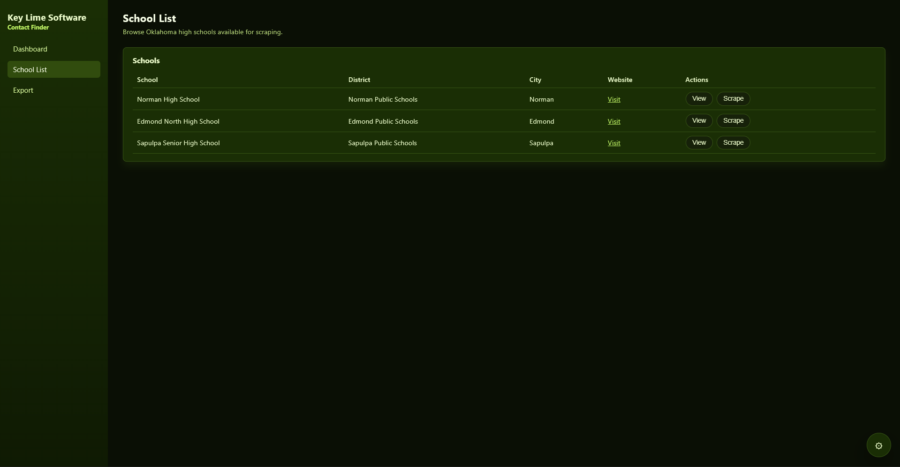
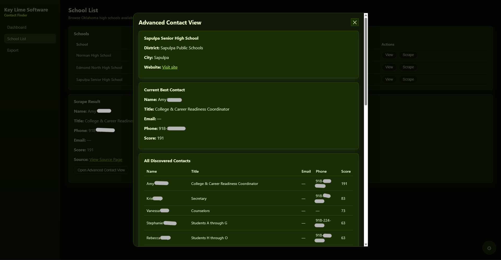
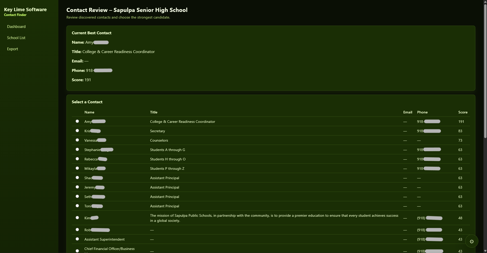
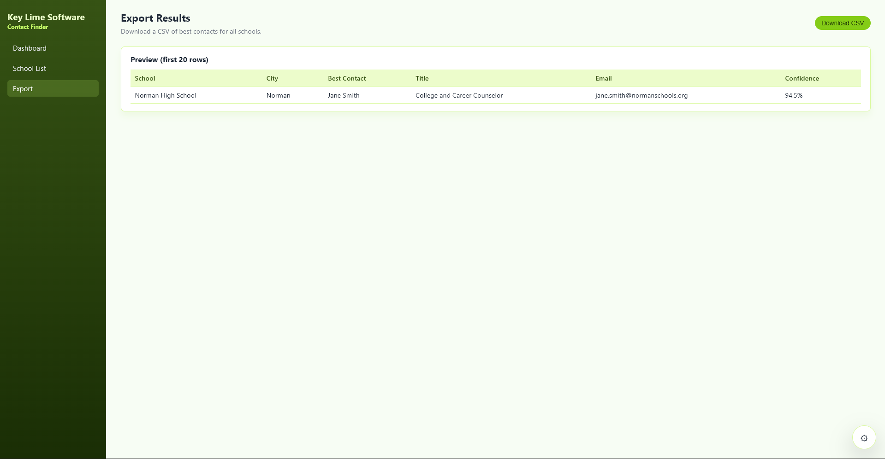
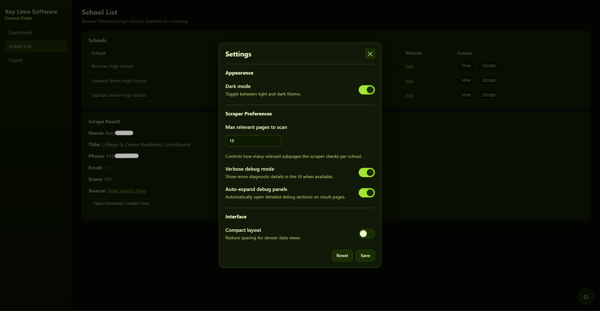

# KLS Contact Finder

**KLS Contact Finder** is a local-first outreach contact management system built for discovering, reviewing, verifying, and tracking school contacts over time.

Originally developed under **Key Lime Software (KLS)**, this project focuses on Oklahoma high school outreach workflows and is designed for practical day-to-day use by a single operator on a local machine.

> Note: The active source repository for the application is private.  
> This public repository is used for project information, release visibility, and previews.

---

## Overview

KLS Contact Finder is not just a scraper.

It is a workflow-focused system for:

- discovering likely contacts from school websites
- reviewing and validating candidate contacts
- storing verified contacts locally
- tracking outreach history and status
- filtering and organizing records
- exporting usable outreach data
- maintaining a trustworthy local dataset over time

The application runs locally and is intended for private, department-level or owner-operated use rather than cloud-hosted multi-user deployment.

---

## Version v0.5.0

### Release Highlights

Version **0.5.0** expands the project from a basic scrape-and-review prototype into a more complete local contact operations tool.

Key additions and improvements include:

- local SQLite-backed persistence for schools, contacts, and outreach history
- batch scrape job tracking with progress and cancellation support
- improved scrape merge behavior to preserve useful data across re-scrapes
- global contact management view with search, filters, sorting, and pagination
- outreach history as a structured, first-class workflow
- CSV preview/validation/commit import flow
- CSV and XLSX export support
- manual school and contact entry flows
- improved settings persistence and live application of settings changes
- stronger scraper cleanup to reject sentence-like junk names and titles
- continued UI refinement for local operational use

---

## Current Capabilities

### School Management
- Local database of school records
- Active/inactive school tracking
- Website status and scrape readiness indicators
- Manual school entry and editing
- School pagination and list management

### Contact Discovery
- Automated contact discovery from public-facing school websites
- Heuristic scoring for likely outreach-relevant roles
- Requests + BeautifulSoup scraping with selective Playwright fallback
- Duplicate reduction and contact merge behavior across re-scrapes
- Improved filtering of junk names and sentence-like title text

### Review Workflow
- **Quick Review** for fast official-contact decisions
- **Full Review** for deeper record management and outreach context
- Reviewer notes and verification tracking
- Official contact selection per school

### Outreach Tracking
- Structured outreach history per contact
- Methods supported:
  - email
  - phone call
  - text
  - in person
  - mailed material
  - other
- Contact status tracking:
  - not contacted
  - attempted
  - responded
  - inactive
- Central outreach activity view

### Contact Management
- Global contact table
- Keyword search
- Filtering by school, district, city, status, email/phone presence, notes, outreach state, and verification state
- Sorting and pagination
- Manual contact entry
- Trust and completeness cues for faster review

### Import / Export
- CSV import preview before commit
- Validation and duplicate-aware import handling
- Export preview and scoped export
- CSV export
- XLSX export

### User Experience
- Settings modal with live-applied preferences
- Dark mode and appearance settings
- Table usability improvements
- Fixed/collapsible sidebar
- Local-first workflow optimized for speed and repeat use

---

## Deployment Model

KLS Contact Finder is designed for **local-first deployment**.

The intended operating model is:

- single owner/operator
- local machine use
- local data storage
- no dependence on external hosted infrastructure
- browser-based local app experience
- packaged desktop launcher support for demo/release builds

This project is intentionally optimized for simple private use before any future multi-user or enterprise features.

---

## Public Repository Note

This public repository does **not** contain the active private source code for the full application.

It exists to provide:

- product overview
- release/version visibility
- preview screenshots
- project notes
- public-facing changelog context

---

## Preview

---

## Product Direction

KLS Contact Finder is being developed toward a stable **v1.0.0** local release focused on:

- stronger contact discovery quality
- clearer trust and verification signals
- better record maintenance over time
- reliable batch workflows
- practical local packaging and deployment

Current development is centered on making the tool operationally dependable rather than expanding into enterprise-only feature areas.

---

## Planned / Ongoing Improvements

Areas still being refined include:

- deeper single-school scrape accuracy
- clearer scrape confidence and source transparency
- stronger full-review record management workflows
- additional duplicate-handling safeguards
- continued UI polish for dense operational tables
- final packaging and local release hardening

---

## Tech Stack

The application is built around a local web app architecture using:

- Python
- FastAPI
- SQLite
- SQLAlchemy
- Jinja2
- Vanilla JavaScript
- HTML / CSS
- Requests
- BeautifulSoup
- Playwright

---

## Status

KLS Contact Finder is currently in an active pre-v1 release phase.

Version **0.5.0** represents a major step forward in turning the project into a practical local outreach operations tool rather than a simple scraping utility.
