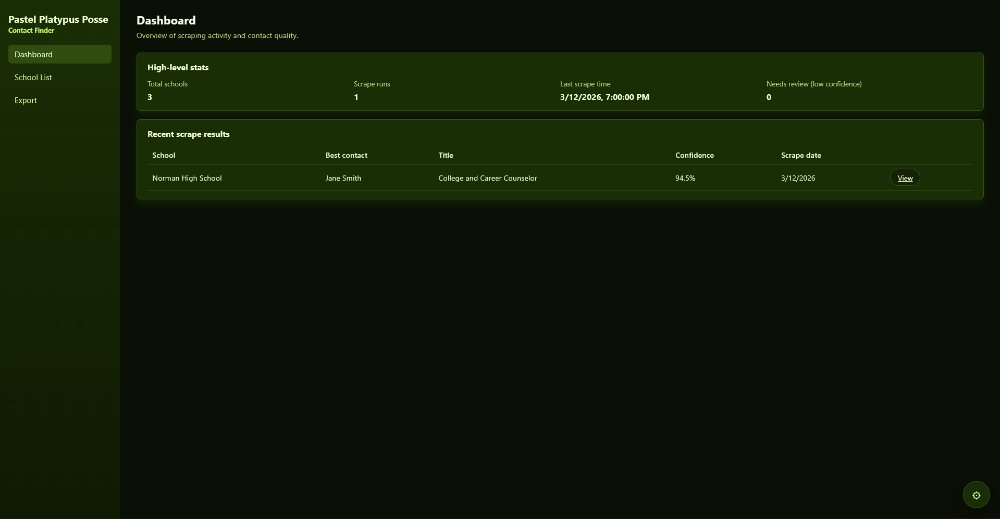
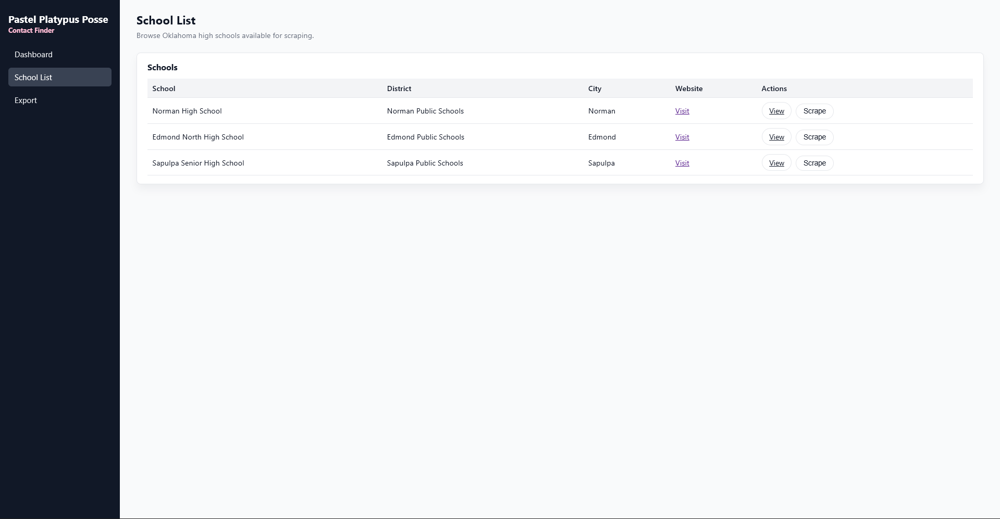
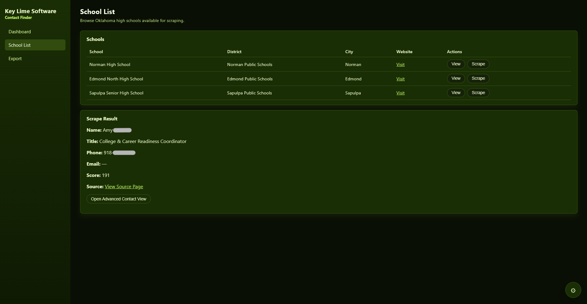
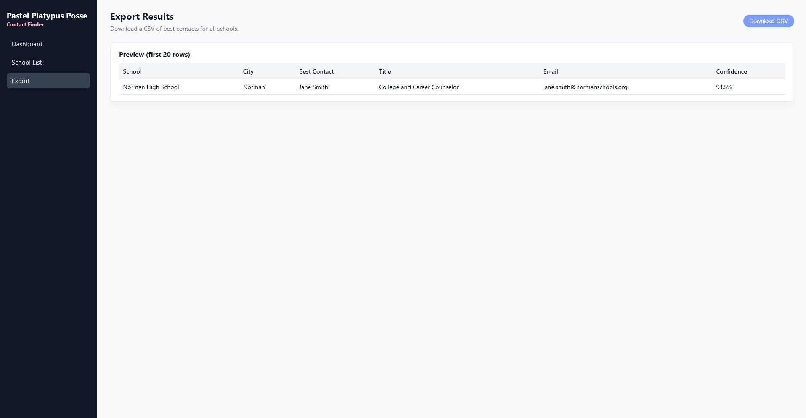

# Key-Lime-Software
Welcome! This is the landing page for all projects related to Key Lime Software (formerly Pastel Platypus Posse). Here you'll see snapshots and information about our products!

# Contact Finder - URL-based Data Extractor

A full-stack web application designed to help identify and organize Oklahoma high school college liaisons and related staff contacts for student outreach initiatives.

## Current Status

This project currently functions as a standalone FastAPI-based local web application for discovering likely school counselor or college-readiness contacts from school websites.

Current features:
- Local browser-based UI
- School list page with scrape trigger
- Custom contact scraper with scoring and deduplication
- Jinja template layout
- CSV export preview
- Contact review workflow scaffolding

Planned next steps:
- SQLite-backed persistence
- CSV-based school seeding
- Manual school entry
- Saving scrape results and contacts to the database

## Deployment Model

The application is being designed for local, department-level installs.
Each department can run its own isolated copy of the software and maintain its own data without relying on a shared server or external database connection.

## Preview

## Features
- Dashboard for scrape activity and contact confidence
- School list view
- School detail and contact review pages
- Export-ready results
- FastAPI backend with JavaScript frontend
- Modular structure for future scraping and ranking logic

## Tech Stack
- Python
- FastAPI
- JavaScript
- HTML/CSS
- SQLite
- VS Code
